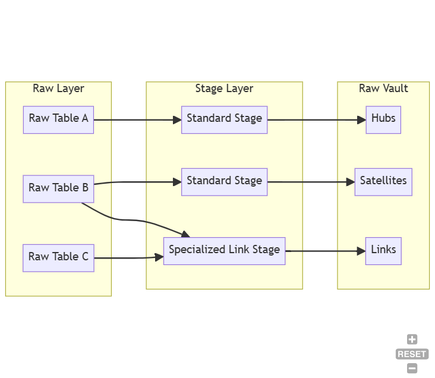

# Data Vault 2.0 for Microsoft Fabric

This project provides an automated tool for building and managing Data Vault 2.0 architecture within Microsoft Fabric, abstracting a lot of work into writing SparkSQL queries into configurations (YAML or code), utilizing Materialized Lake Views via PySpark. 


## Core Architecture
1. **Staging Layer**: Raw Data ingestion with added metadata where Raw vault would directly pull data from (Load Date, Record Source, Pre-calculated Hash Keys with SHA1).
    - Standard Stage: Processes tables needed by Hubs and Satellites
    - Special Link Stage: A dedicated staging for link, pre-calculating hashes and joins, ensuring any future satellites connected to it won't need to do the same

2. **Raw Vault**: Contains the basic vault entities
    - Hubs: Unique business keys.
    - Links: Relationships between business keys.
    - Satellites: Descriptive state over time.



## Features
1. **SQL-Centric Automation**: We use PySpark’s ```sql()``` function as a powerful "Code Generator." By feeding metadata into SparkSQL, the engine automatically builds your Data Vault entities in Materialized Lake Views (MLVs) without manual SQL coding.

2. **Scalable Templating**: Scaling your architecture is as simple as updating a configuration. Whether you prefer using a YAML file or a Python dictionary, the "Template-First" approach ensures that adding 100 new Hubs or Links follows the exact same standardized logic.

3. **Simplicity & Visibility**: Using Materialized Lake Views provides a "setup-once" architecture that is both performant and transparent. Because MLVs are native to Fabric, they appear automatically in the Lineage View, allowing you to visually trace data flow from your Stage tables all the way to your final consumer views.

4. **Configuration-as-Code**: Your entire Data Vault design is portable. You can export your definitions into a YAML file to backup your architecture or import them into a new Fabric Workspace, making it easy to sync environments (Dev/Test/Prod) in seconds.

### Example Usage
```
dv = DataVaultManager("ingestion_time") # Get the default column for ingestion timestamp for downstream timestamping

dv.add_hub(Hub(
    name="hub_quotes",
    schema_name="silver",
    business_key_columns=["id"],
    source_table="cc_fabric_lakehouse_new.bronze.hubspot_quotes"
)).add_hub(Hub(
    name="hub_deals",
    schema_name="silver",
    business_key_columns=["deals"],
    load_datetime_column="load_ts"  # override the default timestamp column
    source_table="cc_fabric_lakehouse_new.bronze.deals"
)).add_link(Link(
    name="link_quote_deal",
    schema_name="silver",
    staging_schema="staging",
    anchor=LinkAnchor(
        table="cc_fabric_lakehouse_new.bronze.hubspot_quotes",  # Anchor table, the table after a FROM sql statement
        hub="hub_quotes",
        bk_columns=["id"]
    ),
    hub_mapping=[
        LinkHubJoin(
            hub="hub_deals",
            table="cc_fabric_lakehouse_new.bronze.hubspot_deals", # Join table, the table after a JOIN sql statement
            bk_columns=["id"],
            join_on={"value": "id"} # FK/PK of the Anchor table to FK/PK of the Joining table
        )
    ]
)).add_satellite(Satellite(
    name="sat_quotes",
    schema_name="silver",
    parent_hub_or_link="hub_quotes",
    descriptive_columns=['id', 'ingestion_time'],
    include_mode=False, # excludes the columns in the descriptive_columns parameter as the descriptive column of the satellite
    source_table="cc_fabric_lakehouse_new.bronze.hubspot_quotes_v1"
))

"""
execute: run the config or not
verbose: print the SQL strings generated
force: force execute even with warnings
"""

dv.construct_vault(execute=True, verbose=True, force=True)
dv.export_config('Files/vault_config.yaml') # export the Data Vault config to yaml

# import yaml config file and run
dv = DataVaultManager.from_config("Files/vault_config.yaml")
dv.construct_vault(execute=True, verbose=True, force=True)
```


### Internal Notebooks
- **dv_core**: Dataclasses and Enums
- **dv_ddl_generator**: DDL (SQL String) Generation for Stage and Vault Entities
- **dv_validator**: Config Parsing validations
- **dv_utils**: Import-Export util, etc...


#### Helpful Addition features for Materialized Lake Views
- More supported SparkSQL statements (ex: Joins apart from Inner Join, ROW_NUMBER(), etc...)
- Controllable concurrency settings
- Column-level Data quality checks to be able to drop records if hash_diff is the same
- Additional column for descriptions in dbo.sys_dq_metrics to know why an MLV fully refreshed instead of incremental
